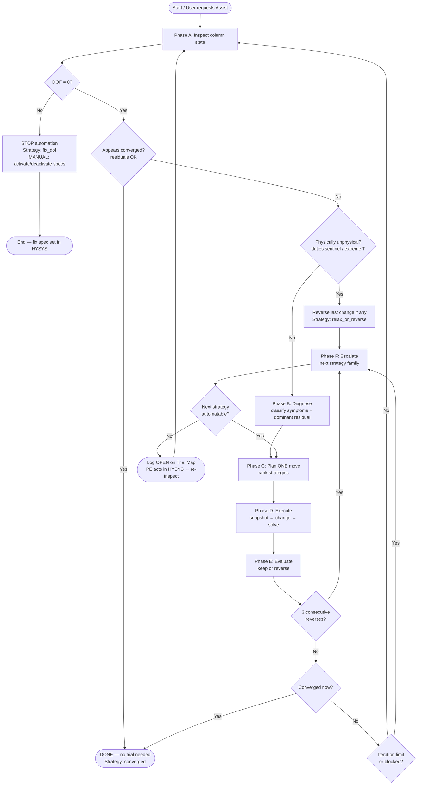
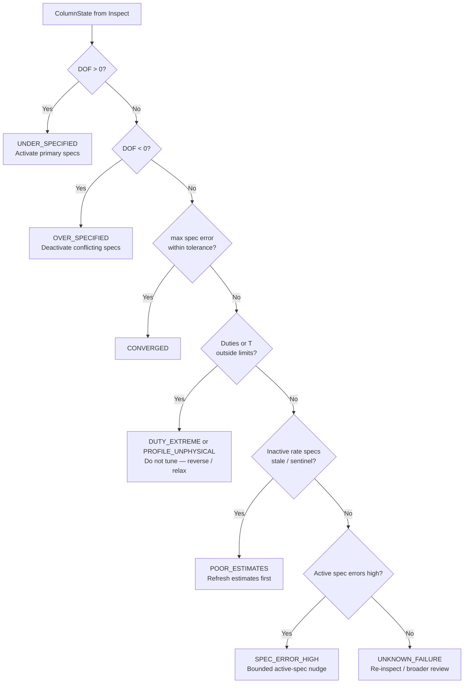
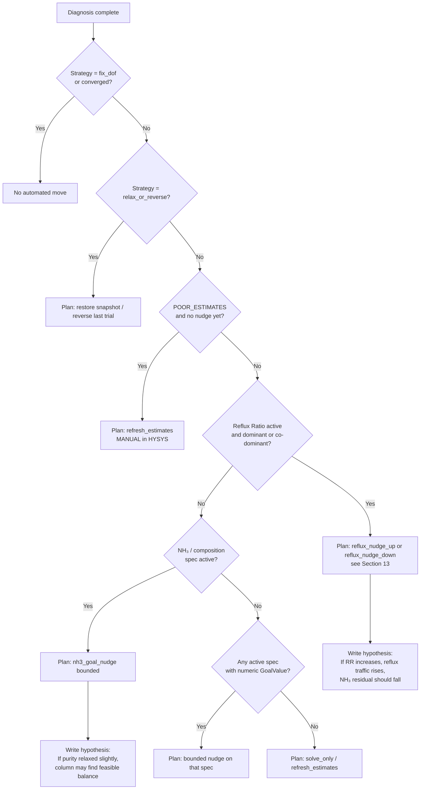
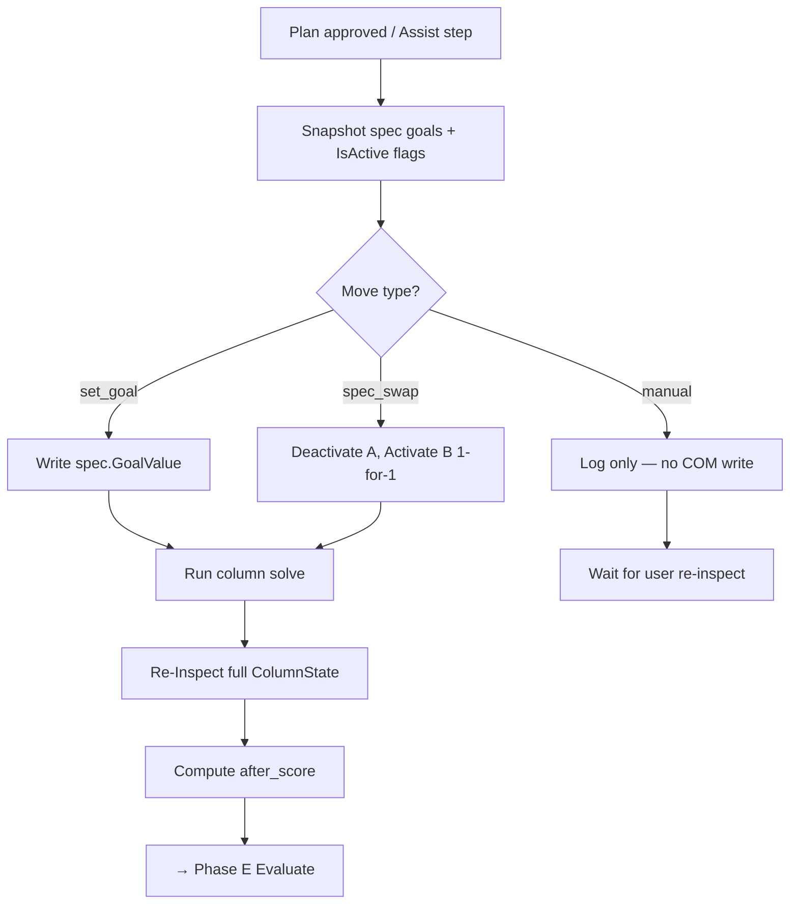
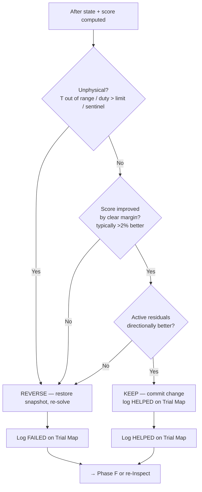
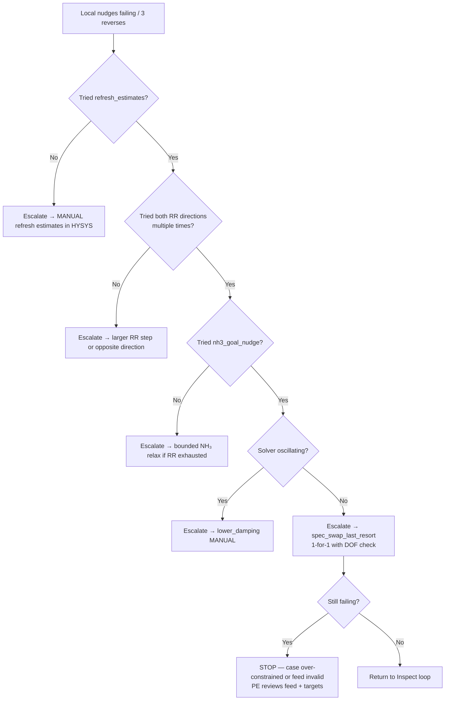

# Column Convergence Playbook — Expert Process Engineer Flow

**Document role:** Operational playbook for **SW Stripper / Studio v0.1** — maps PE
decisions to **what HYSYS exposes** and **what Automation Studio can read or write**.

**Master intelligence (read first):**
[`expert_decision_workflow.md`](expert_decision_workflow.md) — full expert decision
workflow (States A–F, external FINAL_TARGETs vs HYSYS specs, trial response classes,
recovery, infeasibility, **§28 intelligence implementation / P0–P3 roadmap**).

**Intelligence backlog (detail):**
[`intelligence_improvement_notes.md`](intelligence_improvement_notes.md) — gaps, anti-complexity
layers, State E success definition (now integrated into workflow §28).

This playbook is the **first constrained slice** of that specification for the SW Stripper
stress-test case.

**Reference case:** SW Stripper (8 stages, feed stage 3, full reflux condenser)

**Audience:** Process engineers validating strategy · developers implementing
`column_engine.py` · operators using Column Assistant + Trial Map

**Version:** 0.1.1 draft · aligned with `trial_map.STRATEGY_CATALOG` strategy IDs

**Policy from master workflow:** do **not** auto-relax product FINAL_TARGETs
(e.g. bottoms NH₃). Prefer Category-1 operating MVs (RR / energy). Report State F
when operating moves show weak response. Implement Assist intelligence in **layers**
(workflow §28.2) — do not encode the entire bible in one code drop.

---

## Table of contents

1. [Purpose and scope](#1-purpose-and-scope)
2. [Expert principles (non-negotiables)](#2-expert-principles-non-negotiables)
3. [Transferability matrix — PE thought ↔ HYSYS knob](#3-transferability-matrix--pe-thought--hysys-knob)
4. [Master convergence flow](#4-master-convergence-flow)
5. [Phase A — Inspect (read-only orientation)](#5-phase-a--inspect-read-only-orientation)
6. [Phase B — Diagnose (symptom classification)](#6-phase-b--diagnose-symptom-classification)
7. [Phase C — Plan (choose one move)](#7-phase-c--plan-choose-one-move)
8. [Phase D — Execute trial (bounded change + solve)](#8-phase-d--execute-trial-bounded-change--solve)
9. [Phase E — Evaluate (keep or reverse)](#9-phase-e--evaluate-keep-or-reverse)
10. [Phase F — Escalate (when local nudges fail)](#10-phase-f--escalate-when-local-nudges-fail)
11. [Symptom → strategy quick reference](#11-symptom--strategy-quick-reference)
12. [Strategy catalog (Trial Map IDs)](#12-strategy-catalog-trial-map-ids)
13. [Residual dominance decision tree](#13-residual-dominance-decision-tree)
14. [Stop, reverse, and human-intervention rules](#14-stop-reverse-and-human-intervention-rules)
15. [Worked example — stressed SW Stripper case](#15-worked-example--stressed-sw-stripper-case)
16. [Implementation mapping (code ↔ playbook)](#16-implementation-mapping-code--playbook)
17. [Glossary](#17-glossary)
18. [Intelligence layers (integrated)](#18-intelligence-layers-integrated)

---

## 1. Purpose and scope

### What this document is

A **flow-type operational playbook** for SW Stripper convergence, derived from the
master [`expert_decision_workflow.md`](expert_decision_workflow.md). Each box answers:

| Question | Example |
|----------|---------|
| What does the PE observe? | Max spec residual = 1.93 on Reflux Ratio |
| What does it mean physically? | Reflux target too low for separation duty |
| What can HYSYS do? | Change `Reflux Ratio` spec `GoalValue` |
| Can Studio automate it? | **Yes** — `set_spec_goal` + `run_column` |
| When to stop or escalate? | Weak NH₃ response at fixed FINAL_TARGET → State F |

The master workflow owns States A–F, external targets, response classes, and
escalation. This file owns COM transferability and SW Stripper-specific trials.

### What this document is not

- Not a substitute for plant / licensor design limits
- Not a guarantee that every HYSYS UI action has a COM path (see **Manual** tags)
- Not permission to modify a live case without explicit user approval
- Not the full intelligence bible — that is `expert_decision_workflow.md`

### Column types covered (v0.1)

- Distillation / stripper with `ColumnFlowsheet` + `Specifications` collection
- Inside-Out style solve (typical HYSYS column)
- Primary validated reference: **SW Stripper**

---

## 2. Expert principles (non-negotiables)

These rules mirror how an experienced simulation engineer works — and constrain
automation so it does not behave like a blind optimizer.

```text
P1  Specification set first     DOF must be 0 before numerical tuning.
P2  One family per trial         Change reflux OR purity OR feed — never all at once.
P3  Bounded steps                Small nudges; no wild jumps unless case is clearly dead.
P4  Solve after every change     Re-read residuals, duties, profiles — not just "solved" flag.
P5  Keep only on improvement     Residuals + physics must improve; else reverse immediately.
P6  Estimates before spec swaps  Refresh / trust estimates before changing active spec philosophy.
P7  Spec swap is last resort      1-for-1 swap only; never add a spec when DOF is already 0.
P8  Document the trail             Every trial logged on Trial Map with kept/reversed outcome.
P9  Human owns business targets    Purity limits, duty caps, feed validity — engineer decides.
P10 Stop on thrashing              Three consecutive reverses → escalate, do not loop forever.
P11 FINAL_TARGET locked            Never auto-relax product purity (e.g. NH3) without permission.
P12 State before knob              Classify A–F (esp. State B sentinels) before GoalValue nudges.
P13 Worksheet units + stream truth Show rates/purities as HYSYS UI; judge product on streams.
P14 Thin intelligence layers       Encode Assist in P0→P3 slices; keep full PE bible in MD.
```

---

## 3. Transferability matrix — PE thought ↔ HYSYS knob

Every expert action must land in one of three buckets:

| Bucket | Meaning | Studio v0.1 |
|--------|---------|-------------|
| **AUTO** | Read and write via COM; safe for Assist Loop | Implemented |
| **READ** | Diagnosis only; change manually in HYSYS | Partial |
| **MANUAL** | PE must act in HYSYS UI; Studio logs + waits | Not automated |

### 3.1 Read path (diagnosis inputs)

| PE checks | HYSYS / COM source | Studio API |
|-----------|-------------------|------------|
| Degrees of freedom | `ColumnFlowsheet.DegreesOfFreedom` | `ColumnState.degrees_of_freedom` |
| Active specifications | `Specifications[].IsActive` | `ColumnSpecState.is_active` |
| Spec targets | `Specifications[].GoalValue` | `goal_value` |
| Spec calculated values | `Specifications[].CurrentValue` | `current_value` |
| Spec residuals | `Specifications[].Error` | `error`, `max_active_spec_error` |
| Reflux ratio (global) | `ColumnFlowsheet.RefluxRatio` | `reflux_ratio` |
| Stage temperatures | `Main TS.Temperature` | `profile.temperatures` |
| Stage pressures | `Main TS.Pressure` | `profile.pressures` |
| Feed stage location | `FeedStages[].IFaceStageNumber` | `feed_stage` |
| Stage count | `Main TS.NumberOfStages` | `number_of_stages` |
| Attached feeds / products | `AttachedFeeds`, `AttachedProducts` | `feed_streams`, `product_streams` |
| Condenser / reboiler duty | Energy stream heat flow | `condenser_duty`, `reboiler_duty` |
| Overhead / bottoms T, flow | Product material streams | `overhead_*`, `bottoms_*` |
| Converged? | DOF=0 + residuals < tol | `appears_converged` |

### 3.2 Write path (automatable trials)

| PE action | HYSYS / COM | Studio API | Strategy ID |
|-----------|-------------|------------|-------------|
| Nudge active spec goal | `spec.GoalValue = x` | `set_spec_goal` | `reflux_nudge_*`, `nh3_goal_nudge` |
| Activate / deactivate spec | `spec.IsActive` | `set_spec_active` | `fix_dof`, `spec_swap_last_resort` |
| 1-for-1 spec swap | deactivate A, activate B | `swap_active_spec` | `spec_swap_last_resort` |
| Run column solve | `cfs.Run()` / case solve | `run_column` | (all trials) |
| Snapshot before trial | spec goals + active flags | `snapshot` / `restore` | (safety) |
| Change feed composition | stream `ComponentMolarFraction` | stream writer (Stream tab) | `feed_or_case_change` |
| Change feed T, P, flow | stream `SetValue` with units | stream writer | `feed_or_case_change` |

### 3.3 Manual-only (visible in HYSYS; COM not reliable in v0.1)

| PE action | Why manual | Until mapped |
|-----------|------------|--------------|
| Refresh tray composition estimates | UI "Use Estimates" / refresh | `refresh_estimates` logged as OPEN |
| Change solver damping | Column solver page | `lower_damping` LOCKED |
| Increase max iterations | Column solver page | `raise_iterations` LOCKED |
| Edit stage pressure profile | Column profiles | future |
| Change condenser / reboiler type | Column design | out of scope |
| Tray efficiencies / internals | Column design | out of scope |
| Add / remove stages | Column configuration | out of scope |

---

## 4. Master convergence flow

This is the top-level loop every Assist session follows.



---

## 5. Phase A — Inspect (read-only orientation)

**PE intent:** Build a mental picture of the column *before* changing anything.

```mermaid
flowchart LR
    A1[Connect to HYSYS case] --> A2[Select column e.g. SW Stripper]
    A2 --> A3[Read DOF + active specs]
    A3 --> A4[Read residuals Goal vs Current vs Error]
    A4 --> A5[Read RefluxRatio property]
    A5 --> A6[Read Main TS T and P profiles]
    A6 --> A7[Read Cond Q / Reb Q duties]
    A7 --> A8[Read feed stage + stream names]
    A8 --> A9[Record baseline score + Trial Map position]
```



### SW Stripper baseline (converged reference)

| Item | Typical converged value |
|------|-------------------------|
| Stages | 8 |
| Feed stage | 3 |
| Active specs | Reflux Ratio, NH₃ Mass Frac (Reboiler) |
| Inactive estimates | Ovhd Vap Rate, Reflux Rate, Btms Prod Rate |
| DOF | 0 |
| Reflux Ratio | ~10 (case-dependent) |
| NH₃ bottoms goal | ~1e-5 (case-dependent) |

### Inspect checklist

- [ ] DOF displayed and understood
- [ ] List of active specs with Goal, Current, Error
- [ ] Which residual is largest (absolute, ignoring sentinel -32767)
- [ ] Duties finite and sign-consistent with full reflux stripper
- [ ] Temperature profile monotonic-ish (stripper: generally warmer toward bottom)
- [ ] Feed streams identified (external case driver)

**Output:** `ColumnState` snapshot → feeds Phase B.

---

## 6. Phase B — Diagnose (symptom classification)

**PE intent:** Name the failure mode — not jump to a knob.



### Diagnosis codes ↔ recommended strategy

| Code | PE meaning | First strategy | Automatable? |
|------|------------|----------------|--------------|
| `converged` | Balanced, within tolerance | none | n/a |
| `under_specified` | Missing primary spec | `fix_dof` | MANUAL |
| `over_specified` | Too many active specs | `fix_dof` | MANUAL |
| `spec_error_high` | Active targets not met | `nudge_active_goal` | AUTO |
| `poor_estimates` | Bad initialization | `refresh_estimates` | MANUAL (v0.1) |
| `profile_unphysical` | T profile nonsense | `relax_or_reverse` | reverse AUTO |
| `duty_extreme` | Q sentinel or huge | `relax_or_reverse` | reverse AUTO |
| `unknown_failure` | Unclear | re-inspect | READ |

### Dominant residual identification

When multiple active specs have error:

```text
1. Ignore sentinel errors (|error| ≥ 1e4 or CurrentValue = -32767)
2. Rank active specs by |Error| (or weighted error if HYSYS provides)
3. Dominant spec drives Phase C priority:
     Reflux Ratio dominant  → energy / internal recycle mismatch
     NH₃ / composition dominant → separation purity vs energy trade
     Both comparable        → pick ONE family (reflux first on stripper)
```

---

## 7. Phase C — Plan (choose one move)

**PE intent:** Pick the *single best next experiment* with a stated hypothesis.



### Strategy ranking (default stripper / SW Stripper)

Use this order unless diagnosis overrides:

| Priority | Strategy ID | When to use |
|----------|-------------|-------------|
| 1 | `fix_dof` | DOF ≠ 0 — always first |
| 2 | `refresh_estimates` | Stale inactive currents, first failure after case change |
| 3 | `reflux_nudge_up` | RR residual dominant; goal ≪ calculated current |
| 4 | `reflux_nudge_down` | RR residual dominant; goal ≫ calculated current; energy too high |
| 5 | `nh3_goal_nudge` | Purity residual dominant after RR attempts exhausted |
| 6 | `lower_damping` | Oscillating residuals, progress but no convergence |
| 7 | `raise_iterations` | Slow monotonic improvement, hitting iter cap |
| 8 | `spec_swap_last_resort` | All nudges failed; estimates refreshed; DOF=0 |
| 9 | `feed_or_case_change` | Feed upset is root cause — external to column |

### Step-size policy (AUTO moves)

| Parameter | Default step | Bounds | Notes |
|-----------|-------------|--------|-------|
| Reflux Ratio GoalValue | ±5% per trial (`reflux_nudge_fraction`) | min 0.05, max 100 | Increase step to 10–25% if far from Current |
| NH₃ Mass Frac GoalValue | small absolute delta or ±5% | never below 0 | Tighten only if plant requires |
| Max trials per Assist | 12 | configurable | Stop earlier on thrashing |

### One-change rule

```text
ALLOWED combinations per trial:
  ✓ Reflux GoalValue change only
  ✓ NH₃ GoalValue change only
  ✓ Feed composition change only (logged as external)
  ✓ Spec swap deactivate ONE + activate ONE

FORBIDDEN in one trial:
  ✗ Reflux + NH₃ together
  ✗ Spec swap + goal nudge together
  ✗ Feed change + column spec change without re-inspect between
```

---

## 8. Phase D — Execute trial (bounded change + solve)



### Pre-flight checks before COM write

- [ ] User has approved modification (if policy requires)
- [ ] DOF will remain 0 after swap (count active specs)
- [ ] New goal within engineering limits (`ConvergenceLimits`)
- [ ] Snapshot taken

---

## 9. Phase E — Evaluate (keep or reverse)

**PE intent:** Did the experiment support the hypothesis *and* stay physical?



### Scoring dimensions (expert + coded)

| Signal | PE interpretation | Score impact |
|--------|-------------------|--------------|
| DOF ≠ 0 | Spec set wrong | large penalty |
| max active spec error | primary convergence metric | ×100 weight |
| sum active spec errors | secondary | ×20 weight |
| flat or inverted T profile | bad internal solution | penalty |
| extreme duties | energy nonsense | penalty |
| appears_converged | success | score ×0.1 |

**Keep rule:** Improved score **and** physically plausible **and** residuals not worse on dominant spec.

---

## 10. Phase F — Escalate (when local nudges fail)



### Escalation ladder (plain language)

```text
Level 0  Converged                    → stop
Level 1  Fix DOF                      → manual spec set
Level 2  Refresh estimates            → manual HYSYS
Level 3  Reflux nudges (small steps)  → AUTO
Level 4  NH₃ / purity nudges          → AUTO (bounded)
Level 5  Solver tuning                → manual HYSYS
Level 6  1-for-1 spec swap            → AUTO with care
Level 7  Feed / case review           → PE decision
Level 8  Stop — report root cause      → documentation
```

---

## 11. Symptom → strategy quick reference

| Symptom | PE reads | First move | HYSYS knob | Auto? |
|---------|----------|------------|------------|-------|
| DOF = +1 | missing spec | Activate one primary spec | `IsActive` | MANUAL |
| DOF = -1 | over-constrained | Deactivate one spec | `IsActive` | MANUAL |
| RR error largest, goal < current | under-refluxed | Increase RR goal | `Reflux Ratio.GoalValue` | AUTO |
| RR error largest, goal > current | over-refluxed / energy waste | Decrease RR goal | `Reflux Ratio.GoalValue` | AUTO |
| NH₃ error largest, RR OK | purity too tight | Relax NH₃ goal slightly | `NH₃ Mass Frac.GoalValue` | AUTO |
| NH₃ error largest, RR bad | energy first | Fix RR before touching NH₃ | `Reflux Ratio.GoalValue` | AUTO |
| Duties = -32767 | no real solution | reverse; refresh estimates | n/a | MANUAL |
| Flat T profile | collapsed stages | reverse; check feed / RR | n/a | mixed |
| Richer feed (more NH₃) | harder separation | increase RR or relax NH₃ | goal values | AUTO |
| Oscillating residuals | solver too aggressive | lower damping | solver page | MANUAL |
| Case changed externally | context shift | re-inspect; log feed change | feed streams | READ/LOG |

---

## 12. Strategy catalog (Trial Map IDs)

Each row matches `trial_map.STRATEGY_CATALOG` for traceability.

| ID | Label | Family | PE description | Transferability |
|----|-------|--------|----------------|-----------------|
| `refresh_estimates` | Refresh / use estimates | Estimates | Align inactive rate specs with last good solution before changing active set | MANUAL v0.1 |
| `reflux_nudge_down` | Nudge reflux ratio down | Active Spec | Reduce reflux target when over-specified on energy or RR goal above calculated | AUTO |
| `reflux_nudge_up` | Nudge reflux ratio up | Active Spec | Increase reflux when separation under-powered | AUTO |
| `nh3_goal_nudge` | Nudge NH₃ bottoms goal (bounded) | Active Spec | Relax or tighten purity target when reflux path exhausted | AUTO |
| `lower_damping` | Lower solver damping | Solver | Stabilize Inside-Out when residuals oscillate | MANUAL v0.1 |
| `raise_iterations` | Increase max iterations | Solver | Allow slow but monotonic progress to finish | MANUAL v0.1 |
| `spec_swap_last_resort` | 1-for-1 temporary spec swap | Spec Set | e.g. RR active ↔ Reflux Rate estimate path | AUTO (careful) |
| `fix_dof` | Fix degrees of freedom | Spec Set | Must reach DOF=0 before any tuning | MANUAL |
| `feed_or_case_change` | Feed / case change (external) | Case | Feed comp, T, P, flow — root driver outside column | LOG / Stream tab |

### Trial Map status meanings

| Status | Meaning |
|--------|---------|
| OPEN | Not tried |
| NEXT | Recommended by playbook |
| HELPED | Tried and kept |
| FAILED | Tried and reversed |
| LOCKED | Last resort — not until ladder reached |
| DONE_OK | Converged — strategy not needed |

---

## 13. Residual dominance decision tree

Detailed flow for the most common SW Stripper failure: **two active specs, high residuals**.

```mermaid
flowchart TD
    R0[DOF=0, not converged] --> R1[Compute |Error| for each active spec]
    R1 --> R2[Drop sentinel errors]
    R2 --> R3{Dominant = Reflux Ratio?}

    R3 -->|Yes| R4{GoalValue vs CurrentValue?}
    R4 -->|Goal << Current| R5[Hypothesis: need more reflux<br/>→ reflux_nudge_up]
    R4 -->|Goal >> Current| R6[Hypothesis: over-refluxed<br/>→ reflux_nudge_down]
    R4 -->|Similar magnitude| R7[Hypothesis: conflicting specs or bad estimates<br/>→ refresh_estimates first]

    R3 -->|No| R8{Dominant = NH₃ / composition?}
    R8 -->|Yes| R9{RR residual also high?}
    R9 -->|Yes| R10[PE rule: fix energy path first<br/>→ reflux_nudge before nh3_goal_nudge]
    R9 -->|No| R11[Hypothesis: purity infeasible at current RR<br/>→ nh3_goal_nudge relax]

    R8 -->|No| R12[Generic: nudge dominant active GoalValue<br/>or refresh_estimates]

    R5 --> REXEC[Execute ONE trial → Evaluate]
    R6 --> REXEC
    R7 --> RMAN[Manual refresh → re-Inspect]
    R10 --> REXEC
    R11 --> REXEC
    R12 --> REXEC
```

### Direction selection for reflux nudge (AUTO logic)

```text
If Error > 0 (spec overshoot vs goal — HYSYS sign convention):
    try decreasing GoalValue toward Current  → reflux_nudge_down
Else:
    try increasing GoalValue toward Current  → reflux_nudge_up

Always clamp to [min_reflux_ratio, max_reflux_ratio].
If step would be zero-size → escalate to next strategy.
```

---

## 14. Stop, reverse, and human-intervention rules

### Automatic reverse triggers

- Restored snapshot if score not improved by ~2%+
- Duty exceeds `max_duty_abs` (default 5e7)
- Temperature outside `[min_temperature_c, max_temperature_c]`
- COM write or solve throws — restore if possible

### Automatic stop triggers

- `appears_converged` true
- `fix_dof` required
- Three consecutive reversed `set_goal` trials
- `max_iterations` reached in Assist Loop
- No safe knob found (`propose_action` returns solve_only / None)

### Human must intervene when

| Condition | PE action |
|-----------|-----------|
| Business purity limit in question | Confirm whether NH₃ goal can be relaxed |
| Plant duty cap exceeded | Accept higher RR or change case basis |
| Estimates clearly stale | HYSYS: refresh / use estimates |
| Spec philosophy change needed | Decide RR spec vs rate spec swap |
| Feed composition unrealistic | Fix upstream case, not column alone |
| All ladder levels exhausted | Document root cause; workshop with team |

---

## 15. Worked example — stressed SW Stripper case

**Setup (from validation):** Richer sour water feed + NH₃ goal tightened to 1e-7 + RR goal cut to 2.

### Inspect snapshot

| Signal | Value | PE note |
|--------|-------|---------|
| DOF | 0 | Spec set OK |
| Reflux Ratio goal | 2.0 | |
| Reflux Ratio current | ~5.8 | Large gap |
| NH₃ goal | 1e-7 | Very tight |
| Max residual | ~1.93 | Not converged |
| Duties | -32767 sentinel | No real solution |
| Diagnosis | `spec_error_high` | `nudge_active_goal` |

### Expert trail (expected playbook path)

```text
Step 0  INSPECT   DOF=0 but duties bad → note unphysical
Step 1  DIAGNOSE  RR dominant residual; goal << current
Step 2  PLAN      reflux_nudge_up: 2.0 → 2.1 (+5%)
Step 3  EXECUTE   snapshot → set GoalValue → solve
Step 4  EVALUATE  if duties still sentinel → REVERSE or KEEP if improving
Step 5  REPEAT    continue RR up in steps toward ~5–6 band
Step 6  IF RR exhausted and NH₃ still binding
          PLAN nh3_goal_nudge: 1e-7 → 3e-7 (bounded relax) — PE approval
Step 7  IF still stuck
          ESCALATE refresh_estimates (manual HYSYS)
Step 8  IF still stuck
          spec_swap_last_resort (1-for-1) — last resort
```

### Trial Map path (illustrative)

```text
Start → reflux_nudge_up (rev) → reflux_nudge_up (kept) → reflux_nudge_up (kept)
     → nh3_goal_nudge (rev) → refresh_estimates (manual) → YOU ARE HERE
```

---

## 16. Implementation mapping (code ↔ playbook)

| Playbook phase | Module | Function / artifact |
|----------------|--------|---------------------|
| Phase A Inspect | `column_api.py` | `ColumnController.inspect` |
| Phase B Diagnose | `column_engine.py` | `diagnose`, `DiagnosisCode` |
| Phase C Plan | `column_engine.py` | `propose_action` |
| Phase D Execute | `column_api.py` + `column_engine.py` | `snapshot`, `set_spec_goal`, `run_column`, `run_one_trial` |
| Phase E Evaluate | `column_engine.py` | `score_state`, keep/reverse in `run_one_trial` |
| Phase F Escalate | `trial_map.py` | `STRATEGY_CATALOG`, `suggest_next`, `build_trial_map` |
| UI orientation | `gui.py`, `trial_map_window.py` | Column Assistant tab, Trial Map window |
| External feed changes | `hysys_api.py`, Stream tab | logged via `manual_map_event` |

### Gap list (playbook ↔ code) — synced 2026-07-22

Canonical checklist: [`INTELLIGENCE_INVENTORY_V1.md`](INTELLIGENCE_INVENTORY_V1.md).

**Done (CODED):**
- [x] States A–E classification before targeting (P0) — State F classifier still PARTIAL
- [x] External FINAL_TARGET layer — NH₃ locked @ 50 ppmw (P0)
- [x] Worksheet units on Specs display (e.g. Ovhd kgmole/h) (P0)
- [x] Product checks from bottoms **stream** (P0)
- [x] Response classes after each trial (P0) — still score-heavy (PARTIAL)
- [x] Bottoms-flow operability gate (P1 partial)
- [x] `refresh_estimates` COM wired (P1)
- [x] PE board + Connections READ + Specs Summary recommendations

**Still open:**
- [ ] True State F classification (flat FINAL_TARGET sensitivity) (P2)
- [ ] Keep/reverse on FINAL_TARGET + operability first (not score-first) (P0 polish)
- [ ] Spec-role Active swaps — condenser-aware policy (P1)
- [ ] Duty / T-profile / MB gates for State E (P1)
- [ ] Interactive PE board forced default; Assist Loop opt-in only (P1)
- [ ] Going-nowhere / sensitivity stop → State F report (P2)
- [ ] User-visible "PE hypothesis" string in UI (P1)

---

## 17. Glossary

| Term | Definition |
|------|------------|
| **DOF** | Degrees of freedom — must be 0 for fully specified column |
| **Active spec** | Primary specification (`IsActive=True`); drives convergence |
| **Inactive estimate** | Rate / draw estimate used to initialize but not solved to goal |
| **FINAL_TARGET** | External product requirement — locked unless user allows change |
| **GoalValue** | Engineer target on an active spec |
| **CurrentValue** | Column calculated value for that spec |
| **Error** | HYSYS weighted / absolute residual for the spec |
| **Sentinel** | Placeholder value (-32767) meaning "no valid result" |
| **Nudge** | Small bounded change to one GoalValue |
| **Keep / Reverse** | Commit or undo a trial based on score + physics |
| **1-for-1 swap** | Deactivate one active spec, activate one inactive — DOF unchanged |
| **Trial Map** | Engineer orientation UI: path trail + strategy board |
| **Assist Loop** | Automated Inspect → Diagnose → Trial → Evaluate cycle |
| **State E** | Acceptable success — only if stream targets + operability pass |

---

## 18. Intelligence layers (integrated)

Do **not** try to code the entire expert workflow at once. Executable Assist grows as:

| Layer | Content | Status (2026-07-22) |
|-------|---------|---------------------|
| 1 | Read + one MV + keep/reverse + human judge | **CODED** |
| 2 | States A–E + FINAL_TARGET lock + units/stream checks | **CODED (State F PARTIAL)** |
| 3 | Spec-role swaps, sensitivity, State F reporting | **PARTIAL / planned** |
| 4 | Structural / multivariable / hydraulics | Later + permission |

See [`INTELLIGENCE_INVENTORY_V1.md`](INTELLIGENCE_INVENTORY_V1.md) for the coded checklist and master workflow **§28** for P0–P3 policy.

---

## Document maintenance

When COM capabilities expand:

1. Move items from **MANUAL** to **AUTO** in Section 3
2. Update strategy rows in Section 12
3. Implement matching logic in `column_engine.propose_action` **per §18 layer**
4. Re-validate on SW Stripper live case
5. Tick gap-list items; keep [`intelligence_improvement_notes.md`](intelligence_improvement_notes.md) in sync

When adding a new column template:

1. Copy this playbook to a column-specific addendum
2. Document active spec names, typical goal ranges, and feed sensitivity
3. Extend `STRATEGY_CATALOG` if new strategy families are needed
4. Declare FINAL_TARGETs for that column (locked product specs)

---

*End of playbook v0.1.1*
