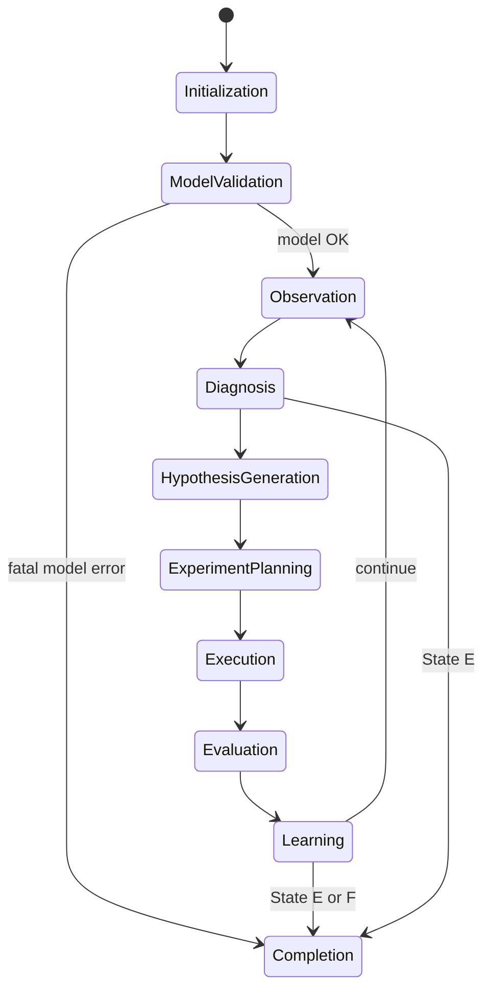

# State Machine — Process Flow & Decision States

**Module ID:** 32  
**Parent:** [`00_System_Architecture.md`](00_System_Architecture.md)  
**Reasoning:** [`33_Reasoning_Engine.md`](33_Reasoning_Engine.md)  
**Experiment selection:** [`35_Experiment_Selection.md`](35_Experiment_Selection.md)  
**Canonical A–F detail:** [`../expert_decision_workflow.md`](../expert_decision_workflow.md) §3  
**Executable:** `column_models.EngineeringState`, `column_engine.diagnose()`

Integrated from `CDU_Expert_Modules_Starter/32_State_Machine.md` + CDU Assist States A–F.

---

## Two views (same session)

| View | Purpose |
|------|---------|
| **Process flow (10 states)** | What step the expert system is in this iteration |
| **Engineering states A–F** | What class of problem the CDU has |

Both must be known before any Level-5 COM move.

---

## Process flow — 10 major states



| # | Process state | PE meaning | CDU Assist today |
|---|---------------|------------|------------------|
| 1 | **Initialization** | Connect, select column (`T-100`) | `HysysController.connect` |
| 2 | **Model Validation** | Assay, thermo, connectivity, DOF | Partial — [`20_Model_Validation.md`](20_Model_Validation.md) |
| 3 | **Observation** | Collect evidence — no MV changes | `column_api.inspect`, specs, streams |
| 4 | **Diagnosis** | Classify A–F, detect abnormalities | `diagnose()` |
| 5 | **Hypothesis Generation** | L3 symptom → L4 mechanism | **Planned** — domain modules |
| 6 | **Experiment Planning** | Rank, pick one reversible family | Partial — [`35_Experiment_Selection.md`](35_Experiment_Selection.md) |
| 7 | **Execution** | Snapshot → one COM change → solve | `ConvergenceAssistant` trial |
| 8 | **Evaluation** | Predicted vs actual; physical? | keep/reverse (partial narrative) |
| 9 | **Learning** | Update confidence, Trial Map | Partial — [`36_Learning_System.md`](36_Learning_System.md) |
| 10 | **Completion** | State E success or State F stop | PE board + report |

---

## Transition rules (non-negotiable)

1. **Never skip Observation before Diagnosis.**  
2. **Every experiment produces a new state snapshot** (before/after evidence).  
3. **Rollback whenever confidence decreases** or operability worsens.  
4. **No Experiment Planning** while in State A or unresolved State B.  
5. **One primary experiment** per iteration — see [`35_Experiment_Selection.md`](35_Experiment_Selection.md).

---

## Engineering states A–F (problem class)

Maps process states 2–4 and gates 6–10.

| State | PE question | Process states allowed | Experiments |
|-------|-------------|------------------------|-------------|
| **A** | Model properly built? | Validation → fix | **None** — fix model |
| **B** | Numerically healthy? | Observation → recovery | Estimates, baseline Active only |
| **C** | Off plant targets? | Full loop 5–9 | Category-1 bounded trials |
| **D** | Constraints violated? | Diagnosis → operability fix | Constraint / split recovery |
| **E** | Acceptable? | → Completion | Stop — report success |
| **F** | Infeasible? | → Completion | Stop — escalate — no FINAL_TARGET relax |

### Mapping: process flow ↔ A–F

```text
Initialization + Model Validation
  → fail connectivity/DOF/assay     → State A
  → pass                            → Observation

Observation + Diagnosis
  → sentinel / unconverged          → State B
  → converged, FINAL_TARGET miss    → State C
  → converged, operability fail     → State D
  → all gates pass                  → State E
  → weak response / exhausted       → State F

State C/D only → Hypothesis → Experiment → Evaluation → Learning → loop
```

---

## CDU operability gates (before State E / Completion)

- No dry / near-zero critical draws or residue  
- No sentinel duties on key energy streams  
- Product streams readable (not stripper OH/btms-only)  
- FINAL_TARGETs met on stream / assay truth  
- DOF = 0 with approved Active set  

**T-100:** `appears_converged=True` but OH/btms sentinels → not State E until Naphtha…Residue reads pass.

---

## Automation hook

| Capability | Status |
|------------|--------|
| Process state tracking | **Planned** — expose in PE board |
| A–F classification | Partial — `diagnose()` |
| Gate before State E | Partial — `physical_solution` (needs CDU reads) |
| Snapshot per experiment | Yes |

---

*Process flow + decision states · CDU Expert System*
