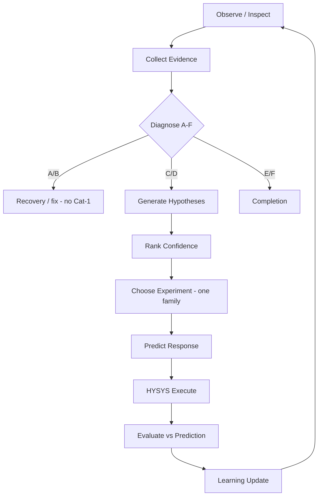

# Reasoning Engine

**Module ID:** 33  
**Parent:** [`00_System_Architecture.md`](00_System_Architecture.md)  
**Process flow:** [`32_State_Machine.md`](32_State_Machine.md)  
**Knowledge base:** [`34_Knowledge_Base.md`](34_Knowledge_Base.md)  
**Experiment selection:** [`35_Experiment_Selection.md`](35_Experiment_Selection.md)  
**Learning:** [`36_Learning_System.md`](36_Learning_System.md)

Integrated from `CDU_Expert_Modules_Starter/33_Reasoning_Engine.md` + CDU Assist code mapping.

> **Note:** [`02_Reasoning_Engine.md`](02_Reasoning_Engine.md) redirects here (legacy path).

---

## Core algorithm

Never: `Problem → Variable`  
Always:

```text
Observe
  → Collect Evidence
  → Generate Hypotheses        (domain modules + 34)
  → Rank Confidence
  → Choose Experiment          (35)
  → Predict Result
  → Run HYSYS
  → Compare Prediction vs Reality
  → Update Confidence          (36)
  → Repeat
```



---

## Confidence score (per hypothesis)

Each hypothesis stores:

| Field | Source |
|-------|--------|
| Supporting evidence | Observations from inspect + streams |
| Contradicting evidence | Neighbor cut worsened, sentinel duty, etc. |
| Historical success | Trial Map — same strategy_id on similar symptom |
| Engineering priority | Module rule weight (e.g. PA before cut GoalValue) |
| Risk | DOF impact, irreversibility, energy penalty |

**Recalculate after every iteration.**  
Low confidence → do not execute; switch family or stop (State F).

Conceptual record:

```python
@dataclass
class Hypothesis:
    id: str
    rule_id: str              # from 34_Knowledge_Base
    subsystem: str            # module 20-30
    symptom: str              # L3
    mechanism: str            # L4
    evidence: list[str]
    confidence: float
    predicted_response: str
    proposed_strategy_id: str   # trial_map
    mv_family: str
    reversible: bool = True
```

---

## Hypothesis generation (rules-first)

1. Load FINAL_TARGET gaps (stream / assay truth) — [`27_Product_Quality.md`](27_Product_Quality.md)  
2. Route symptom → domain module — [`34_Knowledge_Base.md`](34_Knowledge_Base.md) routing table  
3. Module emits 1–3 hypotheses with expected response + side effects  
4. Rank — see confidence fields above  
5. Pass top hypothesis to [`35_Experiment_Selection.md`](35_Experiment_Selection.md)

**T-100 examples:**

| Evidence | Hypothesis | Strategy |
|----------|------------|----------|
| Diesel ASTM 95% low, yields OK | PA_2 heat removal low | `pa_duty_nudge` |
| Diesel yield high, ASTM OK | Material split high | `side_draw_rate_nudge` |
| Kero side wet with lights | Side-strip deficiency | `side_strip_steam_nudge` |

Ranking **penalizes:** FINAL_TARGET GoalValue relax, DOF-breaking Active adds, repeated failed strategy bands.

---

## Volume 0 → code mapping

| Reasoning step | v0.1 code | Gap |
|----------------|-----------|-----|
| Observe / evidence | `column_api.inspect` | PA/SS object board |
| Diagnose A–F | `diagnose()` | CDU operability gates |
| Generate hypotheses | — | **Build** — rules from 34 |
| Rank confidence | — | **Build** — 36 memory |
| Choose experiment | `choose_trial_action()` | CDU not stripper-biased |
| Execute + rollback | snapshot/restore | Yes |
| Evaluate | keep/reverse | Response narrative P0 |
| Learn | `trial_map` | Weak-response P2 |

---

## Implementation targets

| File | Change |
|------|--------|
| `column_models.py` | `Hypothesis`, enriched `Diagnosis` |
| `column_engine.py` | `generate_hypotheses()`, `rank_hypotheses()` |
| `trial_map.py` | Select from ranked hypothesis |
| `intelligence_window.py` | Show hypotheses + confidence |
| `gui.py` | Process state + PE board |

---

*Reasoning engine · CDU Expert System*
